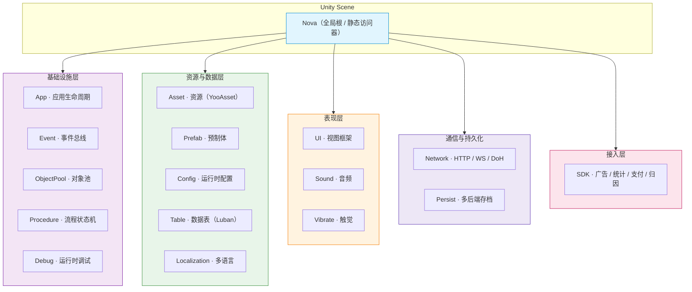

# Nova Framework


**Nova Framework** 是 Solotopia 基于 Unity 打造的**生产级游戏客户端通用框架**。它不是一个游戏，而是一套以「主框架包 + 一组可插拔 UPM 子包」交付的开发工作区，把资源、配置、UI、事件、网络、持久化、热更新、第三方 SDK 接入等客户端共性能力沉淀为开箱即用、职责清晰、可单独演进的工程基座。

---

## 设计理念

Nova 的目标是让团队把精力放在「玩法」而非「客户端基础设施」上。为此它在架构上坚持四条原则：

- **关注点分离（Component + Manager）** —— Unity 生命周期与业务逻辑彻底解耦：`FrameworkComponent` 只做场景挂载与 Inspector 配置，`FrameworkManager` 是纯 C# 逻辑容器，可独立测试、可被热更程序集复用。
- **单一全局入口** —— 所有子系统经 `Nova.Asset` / `Nova.UI` / `Nova.Event` 等静态访问器暴露，调用方一行代码触达任意模块，无需手动持有引用或做依赖注入。
- **分层不可逆依赖** —— Runtime 与 Editor 严格分层、禁止反向依赖；模块间通过接口（`I{Xxx}Manager`）协作，而非具体实现。
- **模块化交付** —— 主框架与每个 SDK/能力包都是独立 UPM 包，按需安装、独立版本、单独升级，避免「全家桶」式耦合。

## 架构总览

Nova 运行时是一棵以 `Nova` 为根的组件树。每个子系统都遵循统一的**三层管理器链**，保证接口稳定、实现可替换、热更可复用：

```
I{Xxx}Manager   (接口：对外契约，定义能力边界)
      ▲
{Xxx}ManagerBase (抽象基类：通用骨架与模板方法)
      ▲
{Xxx}Manager     (具体实现：可被业务/热更替换)
```

`FrameworkComponent` 在场景中作为 Unity 入口，于 `Start` 阶段「现场构造」对应 Manager 并透传 Inspector 配置（Config 为纯 DTO，不参与序列化），随后逻辑全部落到 Manager。



## 启动与生命周期

应用启动由 **`Procedure`（有限状态机）** 编排，流程节点只负责「编排顺序」，真正的执行逻辑回落到各 Component / Manager：

```
启动 → 版本检查 → 资源热更（YooAsset） → 代码热更（HybridCLR / ProcedureLoadDll）
     → 预加载（Persist → Config → Network → SDK → Table → UI → Sound → Vibrate → Localization）
     → 进入业务
```

`ProcedurePreload` 串联各模块的 `LoadAsync`，统一驱动进度与失败重试；热更完成后业务程序集（可热更 DLL）才被加载执行。

## 资源与热更管线

- **资源热更**：基于 [YooAsset](https://github.com/tuyoogame/YooAsset) 封装，统一 Prefab / Scene / Asset 的同步异步加载、预加载、引用计数自动回收，支持远端清单不可达时回退本地/内置清单。
- **代码热更**：集成 [HybridCLR](https://github.com/focus-creative-games/hybridclr)，AOT 元数据补充 + 热更程序集加载，与资源热更在 `Procedure` 中串联。
- **数据管线**：基于 [Luban](https://github.com/focus-creative-games/luban) 的配置/数据表/本地化导出链路（Excel → 二进制 + 代码），编辑器侧由 `DataPipeline` / `ConfigWindow` 驱动，运行时经 `Nova.Table` / `Nova.Config` / `Nova.Localization` 读取。

## 核心子系统

| 子系统 | 全局访问 | 职责 |
|------|---------|------|
| 应用入口 | `Nova.App` | 应用生命周期与全局上下文 |
| 资源管理 | `Nova.Asset` | YooAsset 封装：加载 / 预加载 / 引用计数回收 |
| 预制体 | `Nova.Prefab` | 预制体实例化与池化 |
| 配置 | `Nova.Config` | 运行时配置读取与缓存 |
| 数据表 | `Nova.Table` | Luban 配置表加载与查询 |
| 本地化 | `Nova.Localization` | 多语言文本与字体表 |
| 事件 | `Nova.Event` | 线程安全发布-订阅，支持下一帧 / 立即分发 |
| UI 框架 | `Nova.UI` | 视图生命周期、分组、对象池、设计分辨率适配 |
| 音频 | `Nova.Sound` | 音频播放与音轨管理 |
| 触觉 | `Nova.Vibrate` | NiceVibrations 触觉反馈 |
| 网络 | `Nova.Network` | HTTP / WebSocket / DoH，AES 加密与自动重连 |
| 持久化 | `Nova.Persist` | PlayerPrefs / FileFragment / SQLite(SqlCipher) 三后端，统一 CRUD |
| 流程 | `Nova.Procedure` | FSM 驱动的启动 / 热更 / 业务流程编排 |
| 对象池 | `Nova.ObjectPool` | 通用对象池（`IReference` / GameObject 双通道） |
| SDK 接入 | `Nova.SDK` | 广告 / 统计 / 支付 / 归因等第三方统一抽象 |
| 调试 | `Nova.Debug` | 运行时调试悬浮窗、磁盘监控、设备性能信息 |

## 包结构与交付模型

Nova 以**主包 + 子包**的方式交付，各包独立版本、按需引入：

- **主框架包**：`com.solotopia.nova.framework`（`Assets/Framework`）—— 上述全部核心子系统。
- **能力 Kit 包**：`...kit.network.gamelogin`、`...kit.network.gamesave` 等业务能力扩展。
- **SDK 适配包**（只含适配层，不内嵌商业 SDK 本体）：`sdk.ad` / `sdk.admob` / `sdk.appsflyer` / `sdk.facebook` / `sdk.firebase` / `sdk.iap`(+`mobile`/`thirdpay`/`voucher`) / `sdk.max` / `sdk.tga`。
- **封装的开源基础库**（保留上游 LICENSE/NOTICE）：`unitask` / `yooasset` / `luban` / `hybridclr` / `excelio` / `nicevibrations` / `sqlcipher4unity3d` / `simplediskutils` / `webglsupport` 等。

## 系统需求

| 项目 | 要求 |
|------|------|
| Unity 版本 | 6000.4.2f1 及以上 |
| 渲染管线 | Built-in |
| 输入系统 | Input System 1.19.0 |
| 异步方案 | UniTask（Cysharp） |
| 脚本后端 | IL2CPP（Android / iOS / Standalone） |
| API 级别 | .NET Standard 2.1 / C# 9 |
| 目标平台 | Android / iOS / WebGL / Windows / macOS |

### 核心依赖（与 `Assets/Framework/package.json` 一致）

| 包名 | 版本 | 说明 |
|------|------|------|
| com.unity.textmeshpro | 3.0.9 | 文本渲染 |
| com.unity.nuget.newtonsoft-json | 3.2.2 | JSON 序列化 |
| com.unity.inputsystem | 1.19.0 | 新输入系统 |
| com.solotopia.hybridclr | 10.0.0 | 代码热更 |
| com.solotopia.unitask | 10.0.0 | 零 GC 异步 |
| com.solotopia.yooasset | 1.0.3 | 资源管理 |
| com.solotopia.luban | 10.0.0 | 配置表生成 |
| com.solotopia.sqlcipher4unity3d | 10.0.0 | 加密数据库 |
| com.solotopia.nicevibrations | 10.0.0 | 触觉反馈 |
| com.solotopia.excelio | 1.0.1 | Excel 读写 |
| com.solotopia.simplediskutils | 1.0.2 | 磁盘工具 |

## 安装

通过 UPM Scoped Registry 以依赖形式接入主框架包：

```json
{
  "dependencies": {
    "com.solotopia.nova.framework": "0.5.29"
  }
}
```

> 需要在 `Packages/manifest.json` 中配置对应的 Scoped Registry 才能解析 `com.solotopia.*` 系列包。注册表地址与可用版本请参考发布说明 / 向维护团队索取。
>
> 在 Unity Package Manager 中选中 Nova Framework 包的 **Samples** 标签页，可一键导入 `MainDemo` 演示工程。

## 快速开始

### 1. 加载资源

```csharp
using Cysharp.Threading.Tasks;
using NovaFramework.Runtime;
using UnityEngine;

// 同步加载并实例化 Prefab（按 location 加载，返回带引用计数的句柄）
IAssetHandle<GameObject> handle = Nova.Asset.LoadSync<GameObject>("ui/common/ItemCell");
GameObject go = Object.Instantiate(handle.Asset, parentTransform);

// 异步加载资源（Sprite / AudioClip 等）
IAssetHandle<Sprite> iconHandle = await Nova.Asset.LoadAsync<Sprite>("textures/icons/icon_coin");
image.sprite = iconHandle.Asset;

// 预加载一批资源
await Nova.Asset.PreloadAsync(new[] { "ui/common/ItemCell", "textures/icons/icon_coin" });

// 用完释放句柄（引用计数 -1）；实例对象自行 Object.Destroy
handle.Release();
iconHandle.Release();
```

### 2. 发送 / 监听事件

```csharp
using NovaFramework.Runtime;

// 定义事件数据：继承 EventData（IReference），由 ReferencePool 管理生命周期
public sealed class PlayerLevelUpEventData : EventData
{
    public int NewLevel;

    public static PlayerLevelUpEventData Create(int newLevel)
    {
        var data = ReferencePool.Get<PlayerLevelUpEventData>();
        data.NewLevel = newLevel;
        return data;
    }

    public override void Clear() => NewLevel = 0;
}

// 订阅（按事件类型）
Nova.Event.Subscribe<PlayerLevelUpEventData>(OnPlayerLevelUp);

// 处理（签名为 EventHandler<EventData>）
private void OnPlayerLevelUp(object sender, EventData e)
{
    var data = (PlayerLevelUpEventData)e;
    Log.Debug(LogTag.Base, "玩家升级到 {0} 级。", data.NewLevel);
}

// 发送（Fire 线程安全、下一帧分发；FireNow 立即分发）
Nova.Event.Fire(this, PlayerLevelUpEventData.Create(10));

// 取消订阅
Nova.Event.Unsubscribe<PlayerLevelUpEventData>(OnPlayerLevelUp);
```

### 3. 打开 / 关闭 UI

```csharp
using NovaFramework.Runtime;

// 泛型打开（location / 分组取自 UI 注册表默认配置）
int mainId = Nova.UI.OpenUIViewSync<MainMenuView>();
int shopId = Nova.UI.OpenUIViewAsync<ShopView>(userData: shopData);

// 按 location + 分组名打开
int dialogId = Nova.UI.OpenUIViewSync("ui/dialogs/ConfirmDialog", "Popup");

Nova.UI.CloseUIView(dialogId);        // 关闭单个（按 serialID）
Nova.UI.CloseAllLoadedUIViews();      // 关闭全部已加载视图
```

## 文档体系

Nova 采用「事实层 + 知识层」双轨文档：

```
Assets/Framework/Docs/      # 事实层：当前版本的模块入口、API、字段、调用链、接入步骤（与代码强绑定）
  ├── ARCHITECTURE.md
  ├── INDEX.md              # 类型索引
  ├── Runtime/              # 运行时 API
  └── Editor/               # 编辑器扩展

Assets/Framework/Minds/     # 知识层：ADR、术语、设计模式、历史决策与归档（解释“为什么这样设计”）
```

> 实现真相以代码与 `Docs/` 为准；`Minds/` 提供决策背景与历史依据，不作为普通实现任务的起点。

## 目录结构

```
Assets/Framework/Scripts/Runtime/   # 运行时核心与业务模块
Assets/Framework/Scripts/Editor/    # 编辑器工具、Inspector、窗口、构建与数据流水线
Assets/Framework/Docs/              # 事实层文档
Assets/Framework/Minds/             # 知识层文档
Assets/Samples/                     # 示例与演示（MainDemo 等）
UPMPackages/com.solotopia.*/        # 配套基础库 / Kit / SDK 插件包
Packages/manifest.json              # 工程依赖入口
```

## 许可证

本项目基于 [MIT License](https://opensource.org/licenses/MIT) 开源。

Copyright (c) 2026 Solotopia
