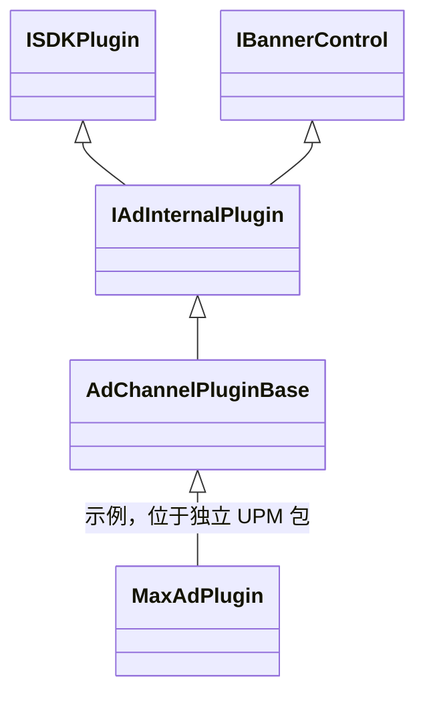

# AdChannelPluginBase

**类签名**：`public abstract partial class AdChannelPluginBase : IAdInternalPlugin`
**命名空间**：`NovaFramework.Runtime`
**源码文件**：`Nova/Scripts/Runtime/AdChannelPluginBase/AdChannelPluginBase.cs`

广告渠道插件公共基类，封装多 ID 状态机（AdUnit 池 + solar 无限重试 + eCPM 最高优先）、打点扇出、七类事件通知与三段式模板方法；渠道 SDK 继承此类实现具体接入。是否支持某 AdFormat 由 `RegisterAdUnits` 注册的槽位推导，未注册即不支持。

---

## §2 文件表

| 文件 | 类 | 说明 |
|---|---|---|
| `AdChannelPluginBase/AdChannelPluginBase.cs` | `AdChannelPluginBase` | 公开 API：abstract/virtual 接口、模板方法（RequestAsync / IsReady / ShowAsync / OnIsReady）、Banner virtual 空实现 |
| `AdChannelPluginBase/AdChannelPluginBase.Visitors.cs` | `AdChannelPluginBase` | 字段与属性：`m_TrackPlugins`、`m_AdUnits`、`m_PendingBatches`、`EnableBidding`、`BannerIlrdInterval`、`MuteAd`、`RetryLoadAdMaxNum`、`RetryLoadAdInterv` |
| `AdChannelPluginBase/AdChannelPluginBase.Methods.cs` | `AdChannelPluginBase` | 私有工具方法：状态机推进（`MarkLoaded` / `MarkLoadFailed` / `MarkShown` / `MarkRevenue` / `MarkBannerHidden`）、注册（`RegisterAdUnits`）、重试调度（`ImmediateRetry` / `ImmediateRetryAsync` / `ScheduleRetry` / `DelayedRetryAsync`）、查找（`FindAdUnit` / `PickBestReadyUnit`） |
| `AdChannelPluginBase/AdChannelPluginBase.Track.cs` | `AdChannelPluginBase` | 事件触发与打点：`Raise*` 系列方法（9 事件全口径）、`TrackAdShow` / `TrackAdClick`、`NotifyBatchLoaded` / `NotifyBatchFailed` |
| `AdChannelPluginBase/AdChannelPluginBase.Definitions.cs` | `AdChannelPluginBase` | 嵌套类型：`AdUnitState` 枚举、`AdUnit` 类、`RequestBatch` 类、`AdUnitOptions` 结构 |

所有文件均位于 `Nova/Scripts/Runtime/`。

---

## §3 继承关系



`IAdInternalPlugin` 继承 `IBannerControl`；`AdChannelPluginBase` 对 Banner 方法提供空 virtual 实现，支持 Banner 的渠道按需重写。

---

## §4 关键字段表

### 实例字段

| 字段 | 类型 | 默认值 | 说明 |
|---|---|---|---|
| `m_TrackPlugins` | `IReadOnlyList<IMonetizeTrackPlugin>` | `null` | 缓存的变现打点插件；`InitializeAsync` 内由 `CacheTrackPlugins` 填充 |
| `m_AdUnits` | `Dictionary<AdFormat, List<AdUnit>>` | `new()` | 各广告格式的 AdUnit 槽位列表；派生类通过 `RegisterAdUnits` 注入 |

### 属性（internal）

| 属性 | 类型 | 默认值 | 说明 |
|---|---|---|---|
| `EnableBidding` | `bool` | `true` | 是否启用多渠道比价；由 `ApplyGlobalConfig` 写入 |
| `BannerIlrdInterval` | `int` | `5` | Banner ILRD 上报间隔次数；0 或负数表示不上报；由 `ApplyGlobalConfig` 写入 |
| `MuteAd` | `bool` | `false` | 是否全局静音所有广告；由 `ApplyGlobalConfig` 写入（`protected internal`） |
| `RetryLoadAdMaxNum` | `int` | `3` | 全局广告加载最大重试次数；达到上限后 `ScheduleRetry` 等待间隔并清零计数继续重试 |
| `RetryLoadAdInterv` | `float` | `30f` | 重试达到上限后等待再次发起的间隔时间（秒）；`DelayedRetryAsync` 使用 |

### 嵌套类型字段（AdUnit）

| 字段 | 类型 | 默认值 | 说明 |
|---|---|---|---|
| `PlacementId` | `string` | — | 广告位唯一标识，来自配置注入 |
| `Format` | `AdFormat` | — | 该槽位对应的广告格式 |
| `State` | `AdUnitState` | `Idle` | 当前状态机状态 |
| `Revenue` | `double` | `0` | Ready 时 SDK 报告的 eCPM 收益（USD）；用于 ShowAsync eCPM 优先排序；展示结束后重置为 0 |
| `RetryCount` | `int` | `0` | 当前已重试次数；加载成功后重置为 0；达到 `RetryLoadAdMaxNum` 后由 `DelayedRetryAsync` 清零重置 |
| `LastErrorMessage` | `string` | `null` | 最近一次加载失败的错误描述文本 |
| `RetryCts` | `CancellationTokenSource` | `null` | 延时/立即重试任务的取消令牌源；`DisposeAsync` 时统一 Cancel 以防泄露 |
| `RequestCustomProps` | `Dictionary<string, object>` | `null` | `RequestAsync` 传入的自定义属性；`fill` / `fill_fail` 打点时合并；续杯时置 null |
| `ShowCustomProps` | `Dictionary<string, object>` | `null` | `ShowAsync` 传入的自定义属性；`show` / `show_result` / `hidden` 打点时合并；续杯前置 null |
| `LastReason` | `AdRequestReason` | `Auto` | 本次 `RequestAsync` 传入的请求原因；仅 `nova_ad_request` 事件使用 |

---

## §5 完整公开 API

### 派生类必须实现（abstract）

```csharp
/// 渠道插件唯一名称；用于日志打点，值作为 nova_ad_channel 字段上报。
public abstract string Name { get; }

/// 当前渠道的枚举类型标识；派生类返回对应的 AdChannelType 值。
public abstract AdChannelType Channel { get; }

/// 执行渠道 SDK 的实际初始化逻辑；由 InitializeAsync 在缓存打点插件后调用。
/// 派生类须在此方法内调用 RegisterAdUnits 完成多 ID 槽位注入。
/// 注册了哪些 AdFormat 即视为支持该格式，未注册即不支持。
protected abstract UniTask InitChannelSDKAsync(IAdChannelConfig config, CancellationToken ct);
```

### 模板方法（public，不得重写）

```csharp
/// 初始化模板方法：先缓存打点插件，再调派生类 InitChannelSDKAsync。
/// 派生类不得重写，只能实现 InitChannelSDKAsync。
public async UniTask InitializeAsync(IAdChannelConfig config, CancellationToken ct);

/// 释放模板方法：先取消所有 AdUnit 的延时重试任务，再委托派生类 DisposeChannelSDKAsync。
/// 派生类不得重写，只能重写 DisposeChannelSDKAsync。
public UniTask DisposeAsync(CancellationToken ct);

/// 将全局广告配置写入渠道实例（EnableBidding / BannerIlrdInterval / MuteAd / RetryLoadAdMaxNum / RetryLoadAdInterv）。
/// 由 AdPlugin 在创建渠道实例后立即调用。
public void ApplyGlobalConfig(AdChannelConfigList globals);

/// 异步请求指定格式广告；遍历该 format 的 AdUnit 列表，对所有 Idle 槽位并行发起 OnRequestAsync（fire-and-forget），
/// SDK 回调通过 RaiseAdLoaded / RaiseAdLoadFailed 推进状态机。
/// 任一广告位加载成功后立即返回 Success=true 的 AdLoadResult；全部失败时返回 Success=false 并携带错误详情。
/// 未注册该 format 时直接返回 Success=false（不抛异常）。
/// 业务层可用 result.Success 判断是否加载成功。
public UniTask<AdLoadResult> RequestAsync(AdFormat format, AdRequestReason reason = AdRequestReason.Auto, Dictionary<string, object> customProps = null, CancellationToken ct = default);

/// 查询指定格式广告是否已加载完毕；需同时满足两个条件才返回 true：
/// ① 列表中存在 AdUnit 处于 Ready 状态；② 对该 placementId 调 OnIsReady(format, placementId) 返回 true。
/// 未注册该 format 时返回 false。
public bool IsReady(AdFormat format);

/// 异步展示指定格式广告；从 Ready 槽位中按 Revenue 降序取 eCPM 最高的槽位展示。
/// 非 Banner 展示结束后自动触发 RequestAsync 续杯（Banner 不续杯）。
/// 未注册该 format 或无 Ready 槽位时返回失败结果（fail-soft，不抛异常）。
/// OnShowAsync 抛出异常时槽位回置 Idle，防止永久卡在 Showing 状态。
public async UniTask<AdResult> ShowAsync(AdFormat format, Dictionary<string, object> customProps = null, CancellationToken ct = default);
```

### 用户身份同步

```csharp
/// 同步登录用户 userId 到本渠道 SDK，默认空实现。
/// 渠道有原生 SetUserId API（如 MaxSdk.SetUserId）时 override。
/// AdPlugin 订阅 SDKEventData.UserLogin 后 fanout 调用此方法；try/catch 隔离，单渠道异常不影响其他渠道。
public virtual void SetUserId(string userId);
```

### 派生类可选重写（virtual）

```csharp
/// 查询指定格式已加载广告的最高预期收益（USD）；基类返回 0。
public virtual float GetMaxRevenue(AdFormat format);

/// 执行渠道 SDK 的实际释放逻辑；基类返回 UniTask.CompletedTask。
protected virtual UniTask DisposeChannelSDKAsync(CancellationToken ct);

/// 向渠道 SDK 查询指定 placementId 当前是否仍处于可播放状态；基类默认返回 true（仅以状态机为准）。
/// MAX / AdMob 等渠道重写此方法，调用 MaxSdk.IsRewardedAdReady(placementId) 等真实 SDK 查询。
/// IsReady 同时满足"状态机 Ready"和"OnIsReady 返回 true"才返回 true。
protected virtual bool OnIsReady(AdFormat format, string placementId);

/// 执行实际预加载；基类默认抛 AdFormatNotSupportedException。
/// 派生类用 switch(format) 覆盖支持的格式（即通过 RegisterAdUnits 注册的格式）；每次调用只针对一个 placementId。
protected virtual UniTask OnRequestAsync(AdFormat format, string placementId, CancellationToken ct);

/// 执行实际展示；基类默认抛 AdFormatNotSupportedException。
/// ShowAsync 已从 Ready 列表中按 eCPM 优先选出 placementId 后调用。
protected virtual UniTask<AdResult> OnShowAsync(AdFormat format, string placementId, CancellationToken ct);

// Banner 控制（全部为 virtual 空实现，支持 Banner 的渠道按需重写）
public virtual void ShowBanner();
public virtual void HideBanner();
public virtual void DestroyBanner();
public virtual void UpdateBannerPosition(BannerPosition position);
public virtual void UpdateBannerPosition(Vector2 position);
public virtual void StartBannerAutoRefresh();
public virtual void StopBannerAutoRefresh();
public virtual void SetBannerWidth(float width);
public virtual float GetAdaptiveBannerHeight(float width = -1f);   // 基类返回 -1
public virtual void SetBannerBackgroundColor(Color color);
```

### 配置注入方法（protected）

```csharp
/// 向状态机注册指定 format 的多 ID 槽位列表。
/// 空 options 直接 Warning 跳过；同 placementId 重复时 Warning 跳过。
/// 派生类须在 InitChannelSDKAsync 内部调用此方法完成槽位注入。
protected void RegisterAdUnits(AdFormat format, IReadOnlyList<AdUnitOptions> options);
```

### 状态机辅助方法（protected）

```csharp
/// Banner 隐藏或销毁后，将对应 AdUnit 回置 Idle（Banner 不触发续杯）。
/// 派生类在 HideBanner / DestroyBanner 回调中调用。
protected void MarkBannerHidden(string placementId);
```

### Raise* 辅助方法（protected）

执行顺序：**先驱动状态机 → 再事件 fan-out → 再打点**。

```csharp
/// 触发 OnAdRevenuePaid 事件，并驱动打点扇出（nova_ad_revenue_paid）。
/// 内部先调 MarkRevenue 更新 AdUnit.Revenue。须在主线程调用。
protected void RaiseRevenue(AdEvent e);

/// 触发 OnAdLoaded 事件，并驱动打点扇出（nova_ad_fill）。
/// 内部先调 MarkLoaded（置 Ready，重置 RetryCount，取消 pending 重试）。须在主线程调用。
protected void RaiseAdLoaded(AdLoadResult e);

/// 触发 OnAdLoadFailed 事件，并驱动打点扇出（nova_ad_fill_fail）。
/// 内部先调 MarkLoadFailed（solar 重试语义：未达 RetryLoadAdMaxNum 时立即重试；达上限后等待 RetryLoadAdInterv 秒清零计数继续无限重试）。须在主线程调用。
protected void RaiseAdLoadFailed(AdLoadResult e);

/// 触发 OnInitResult 事件，同时上报 nova_ad_init 打点（nova_success + nova_ad_channel）。
protected void RaiseInitResult(bool success);

/// 触发 OnShowCompleted 事件，并上报 nova_ad_show_result（nova_ad_result=1）打点。
/// 内部先调 MarkShown（Showing → Idle，非 Banner 触发续杯）。
protected void RaiseShowCompleted(AdResult result);

/// 触发 OnShowFailed 事件，并上报 nova_ad_show_result（nova_ad_result=0）打点。
/// 内部先调 MarkShown（Showing → Idle，非 Banner 触发续杯）。
protected void RaiseShowFailed(AdResult result);

/// 触发 OnAdClosed 事件，并在基类内部上报 nova_ad_hidden 打点（含 nova_can_get_reward）。
/// 内部先调 MarkShown（Showing → Idle，非 Banner 触发续杯）。
/// rewarded：是否满足奖励条件，激励视频使用，其他格式传 false。
protected void RaiseAdClosed(AdResult result, bool rewarded = false);
```

### 打点辅助方法（protected）

```csharp
/// 上报 nova_ad_show 事件（广告展示回调中调用）。
/// 基类自动从对应 AdUnit 取 ShowCustomProps 合并；派生侧调用面无需传 customProps。
protected void TrackAdShow(AdFormat format, string placementId);

/// 上报 nova_ad_click 事件（广告点击回调中调用）。
/// 基类自动从对应 AdUnit 取 ShowCustomProps 合并。
protected void TrackAdClick(AdFormat format, string placementId);
```

> `TrackAdClose` 已删除，并入 `RaiseAdClosed(result, rewarded)`。
>
> `TrackAdRequest` 签名已变更，并内化为 `RequestAsync` 基类自动调用（每个 Idle/Failed-未到上限的 AdUnit 发起请求前自动触发），派生类不再需要手动调用。新签名：
> ```csharp
> protected void TrackAdRequest(AdFormat format, string placementId, AdRequestReason reason, Dictionary<string, object> customProps);
> ```

### 打点工具方法（private static）

```csharp
/// 将自定义属性合并到目标字典；已存在的 key 跳过，不覆盖基础属性。custom 为 null 时静默跳过。
private static void MergeCustom(Dictionary<string, object> target, Dictionary<string, object> custom);
```

### 事件字段

| 事件 | 签名 | 触发时机 | 打点事件 |
|---|---|---|---|
| `OnAdRevenuePaid` | `event Action<AdEvent>` | `RaiseRevenue` | `nova_ad_revenue_paid` |
| `OnAdLoaded` | `event Action<AdLoadResult>` | `RaiseAdLoaded` | `nova_ad_fill` |
| `OnAdLoadFailed` | `event Action<AdLoadResult>` | `RaiseAdLoadFailed` | `nova_ad_fill_fail` |
| `OnInitResult` | `event Action<bool>` | `RaiseInitResult` | `nova_ad_init` |
| `OnShowCompleted` | `event Action<AdResult>` | `RaiseShowCompleted` | `nova_ad_show_result`（result=1） |
| `OnShowFailed` | `event Action<AdResult>` | `RaiseShowFailed` | `nova_ad_show_result`（result=0） |
| `OnAdClosed` | `event Action<AdResult>` | `RaiseAdClosed` | `nova_ad_hidden` |

### 嵌套类型

```csharp
// AdChannelPluginBase.Definitions.cs

// 无 Failed 终止态：solar 重试语义下重试无限进行，不存在永久失败状态
protected enum AdUnitState { Idle, Loading, Ready, Showing }

protected sealed class AdUnit
{
    public string PlacementId;
    public AdFormat Format;
    public AdUnitState State;
    public double Revenue;                                  // eCPM (USD)；double 类型
    public int RetryCount;                                  // 当前轮次已重试次数；达 RetryLoadAdMaxNum 后由 DelayedRetryAsync 清零
    public string LastErrorMessage;
    public CancellationTokenSource RetryCts;
    public Dictionary<string, object> RequestCustomProps;  // fill/fill_fail 打点合并；续杯时置 null
    public Dictionary<string, object> ShowCustomProps;     // show/show_result/hidden 打点合并；续杯前置 null
    public AdRequestReason LastReason;                     // nova_ad_request 事件使用
}

protected sealed class RequestBatch
{
    public UniTaskCompletionSource<AdLoadResult> Tcs;
    public HashSet<string> PendingPlacementIds;
    public CancellationTokenRegistration Registration;
}

// 重试参数已提升到全局（AdChannelConfigList），AdUnitOptions 只承载 PlacementId
public readonly struct AdUnitOptions
{
    public readonly string PlacementId;

    public AdUnitOptions(string placementId);
}
```

---

## §6 生命周期状态机

### 插件级生命周期

```
[未初始化]
    ↓ InitializeAsync(config, ct)
    │  1. CacheTrackPlugins()
    │  2. InitChannelSDKAsync(config, ct)  ← 派生类调 RegisterAdUnits 注入多 ID 槽位
    │  3. 渠道 SDK 回调 → RaiseInitResult(true/false)
    ↓
[已初始化]
    ├─→ RequestAsync(format, reason, customProps, ct)
    │      ↓ 若任一 unit 已 Ready → 立即返回 Success=true 的 AdLoadResult，不入批次
    │      ↓ 写入 AdUnit.LastReason / RequestCustomProps；上报 nova_ad_request
    │      ↓ 遍历 Idle/Failed-未到上限 + 已 Loading/Showing 的 AdUnit → 构造 RequestBatch
    │      ↓ 并行 OnRequestAsync(fire-and-forget)；返回 tcs.Task（任一就绪即结算）
    │      ├─→ RaiseAdLoaded(e)      → MarkLoaded → NotifyBatchLoaded → OnAdLoaded event → 打点
    │      └─→ RaiseAdLoadFailed(e)  → MarkLoadFailed → NotifyBatchFailed → 重试调度 → OnAdLoadFailed event → 打点
    │
    ├─→ IsReady(format)  → 任一 AdUnit.State == Ready 且 OnIsReady(format, placementId)==true 即 true
    │
    ├─→ ShowAsync(format, customProps, ct)
    │      ↓ 写入 AdUnit.ShowCustomProps
    │      ↓ PickBestReadyUnit（Revenue 降序）
    │      ↓ 置 Showing
    │      ↓ OnShowAsync(format, placementId, ct)
    │      ↓ 渠道 SDK 展示回调
    │      ├─→ RaiseRevenue(e)              → MarkRevenue → OnAdRevenuePaid event → 打点
    │      ├─→ RaiseShowCompleted(r)        → MarkShown → OnShowCompleted event → nova_ad_show_result（非Banner续杯）
    │      ├─→ RaiseShowFailed(r)           → MarkShown → OnShowFailed event → nova_ad_show_result（非Banner续杯）
    │      └─→ RaiseAdClosed(r, rewarded)  → MarkShown → OnAdClosed event → nova_ad_hidden（非Banner续杯）
    │
    └─→ DisposeAsync(ct)
           ↓ CancelAllRetryCts()   ← 取消所有 pending 重试
           ↓ DisposeChannelSDKAsync(ct)
```

### AdUnit 单槽位状态机

```
         RegisterAdUnits
              ↓
           [Idle]
              │ RequestAsync → 置 Loading
              ↓
          [Loading]  ←──────────────────────────────────────────────────────┐
              │                                                               │
    ┌─────────┴──────────┐                                                   │
    │                    │                                                    │
RaiseAdLoaded      RaiseAdLoadFailed                                         │
    │                    │                                                    │
    │          RetryCount < RetryLoadAdMaxNum                                │
    │                    │ ImmediateRetry（UniTask.Yield 推迟一帧）          │
    │                    └─────────────────────────────────────────────────→─┘
    │
    │          RetryCount >= RetryLoadAdMaxNum
    │                    │ ScheduleRetry + UniTask.Delay(RetryLoadAdInterv)
    │                    │ 延迟结束后 RetryCount=0 → 回 Loading 继续无限重试
    │                    │
    ↓              [Idle]（等待延时重试期间处于 Idle，非终态）
  [Ready]
    │ ShowAsync → PickBestReadyUnit → 置 Showing
    ↓
 [Showing]
    │
    ├─→ RaiseShowCompleted / RaiseShowFailed / RaiseAdClosed
    │      → MarkShown → 回 [Idle]
    │         非 Banner：自动触发 RequestAsync 续杯
    │
    └─→ MarkBannerHidden（Banner 派生类调用）
           → 回 [Idle]（Banner 不触发续杯）
```

---

## §8 初始化时序

1. `AdPlugin.OnInitializeAsync` 遍历 `AdPluginConfig.ChannelConfigs`，按 `IAdChannelConfig.PluginType` 通过反射创建各 `AdChannelPluginBase` 子类实例。
2. 对每个渠道实例调用 `ApplyGlobalConfig(adConfig.ChannelConfigs)`，透传 5 个全局开关（EnableBidding / BannerIlrdInterval / MuteAd / RetryLoadAdMaxNum / RetryLoadAdInterv）。
3. 对每个渠道实例调用 `InitializeAsync(channelConfig, ct)`。
4. `InitializeAsync` 内部：先 `CacheTrackPlugins()`（从 `Nova.SDK.GetAll<IMonetizeTrackPlugin>()` 缓存打点插件列表），再调 `InitChannelSDKAsync`。
5. 派生类在 `InitChannelSDKAsync` 内调用 `RegisterAdUnits(format, options)` 完成多 ID 槽位注入，之后初始化 SDK。
6. `InitChannelSDKAsync` 由渠道 SDK 回调触发 `RaiseInitResult`，`AdPlugin` 订阅 `OnInitResult` 后转发到 `AdPluginEvents.InitResult`。

**UserLogin fanout 链路：** `AdPlugin` 在 `OnInitializeAsync` 末尾订阅 `SDKEventData.UserLogin`；收到事件后遍历 `m_ChannelPlugins` 调用每个渠道的 `SetUserId(userId)`。每个渠道调用均被 try/catch 隔离：单渠道异常不影响其他渠道的 SetUserId 调用。渠道无对应原生 API 时保留基类空实现（不做任何操作）即可。

---

## §9 关键算法

### 多 ID 请求（RequestAsync）—— UCS 批次算法

```
RequestAsync(format, reason, customProps, ct):
  if m_AdUnits[format] 不存在或为空 → return AdLoadResult{Success=false}  // 未注册即不支持，fail-soft

  tcs = new UniTaskCompletionSource<AdLoadResult>()
  batch = new RequestBatch { Tcs = tcs, PendingPlacementIds = new HashSet<string>() }

  for each unit in m_AdUnits[format]:
    // ① 已就绪：立即结算，不入批次，直接返回
    if unit.State == Ready:
      tcs.TrySetResult(AdLoadResult { Success=true, Format, PlacementId, Revenue })
      return tcs.Task

    // ② 已在飞行中（Loading / Showing）：加入批次等待，不发起新请求
    if unit.State == Loading || unit.State == Showing:
      batch.PendingPlacementIds.Add(unit.PlacementId)
      continue

    // ③ Idle：写 reason 和 customProps，置 Loading，发起请求
    unit.LastReason = reason
    unit.RequestCustomProps = customProps
    unit.State = Loading
    batch.PendingPlacementIds.Add(unit.PlacementId)
    TrackAdRequest(format, unit.PlacementId, reason, customProps)   // 基类自动打点
    InvokeOnRequestSafeAsync(unit, format, ct).Forget()

  // ④ 无任何等待 ID（全部在延时重试期处于 Idle 但不发起新请求）：立即结算失败
  if batch.PendingPlacementIds.Count == 0:
    return AdLoadResult{Success=false, ErrorCode, ErrorMessage}

  m_PendingBatches.Add(batch)
  if ct.CanBeCanceled:
    batch.Registration = ct.Register(() =>
      if batch.Tcs.TrySetCanceled(ct): m_PendingBatches.Remove(batch))
  return tcs.Task

推进入口（由 RaiseAdLoaded / RaiseAdLoadFailed 触发）：
  NotifyBatchLoaded(e):
    倒序遍历 m_PendingBatches
    if batch.PendingPlacementIds 包含 e.PlacementId:
      if batch.Tcs.TrySetResult(e) → 移除该批次

  NotifyBatchFailed(placementId):
    // solar 语义：无 Failed 终止态，每次失败都通知调用方本批已失败；底层重试独立运转。
    倒序遍历 m_PendingBatches：
      从 batch.PendingPlacementIds 移除 placementId
      if PendingPlacementIds 为空：
        batch.Tcs.TrySetResult(default)   // 所有 ID 本批均失败，以 default 结算
        移除该批次

DisposeAsync 时：
  CancelAllRetryCts() 遍历 m_PendingBatches，对所有活跃批次调 Tcs.TrySetCanceled()
  m_PendingBatches.Clear()
```

### eCPM 最高优先展示（ShowAsync）

```
ShowAsync(format, customProps, ct):
  unit = PickBestReadyUnit(format)   // 遍历 Ready 列表（同时满足 OnIsReady），按 Revenue 降序取首个
  if unit == null → return AdResult{Success=false, "no ready ad unit"}  // fail-soft，不抛异常
  unit.ShowCustomProps = customProps
  unit.State = Showing
  try:
    return await OnShowAsync(format, unit.PlacementId, ct)
  catch OperationCanceledException:
    unit.State = Idle; throw
  catch Exception:
    unit.State = Idle; return AdResult{Success=false, ErrorMessage}
```

### solar 重试语义（MarkLoadFailed + ImmediateRetry + ScheduleRetry）

```
MarkLoadFailed(placementId, err):
  unit.LastErrorMessage = err
  unit.State = Idle
  unit.RetryCount++
  if RetryCount < RetryLoadAdMaxNum:
    ImmediateRetry(unit)   // 立即重试：UniTask.Yield 推迟一帧后发起 OnRequestAsync
    return
  // 达到上限：等待全局间隔，清零计数后继续无限重试
  ScheduleRetry(unit)

ImmediateRetry(unit):
  cancel & dispose 旧 RetryCts（防重叠）
  unit.RetryCts = new CancellationTokenSource()
  ImmediateRetryAsync(unit, ct).Forget()

ImmediateRetryAsync(unit, ct):
  await UniTask.Yield(PlayerLoopTiming.Update, ct)  // 推迟一帧，打散递归
  unit.State = Loading
  await InvokeOnRequestSafeAsync(unit, unit.Format, ct)

ScheduleRetry(unit):
  cancel & dispose 旧 RetryCts（防重叠）
  unit.RetryCts = new CancellationTokenSource()
  DelayedRetryAsync(unit, ct).Forget()

DelayedRetryAsync(unit, ct):
  await UniTask.Delay(TimeSpan.FromSeconds(RetryLoadAdInterv), ct)  // 全局间隔
  unit.RetryCount = 0   // 清零后继续无限重试
  unit.State = Loading
  await InvokeOnRequestSafeAsync(unit, unit.Format, ct)
```

### 打点属性构建

`BuildBaseProps` 构建三个基础属性 `{ nova_ad_channel, nova_ad_format, nova_ad_id }`（`nova_ad_channel` 值为 `Name` 字符串）；`TrackAdShow` / `TrackAdClick` 额外调用 `MergeCustom` 合并 `unit.ShowCustomProps`（已有 key 跳过，不覆盖基础属性）。

---

## §10 常见误区

- **误区：重写 `InitializeAsync` / `DisposeAsync`**：这两个方法非 virtual，派生类不得重写；应实现 `InitChannelSDKAsync` / `DisposeChannelSDKAsync`。
- **误区：重写 `RequestAsync` / `IsReady` / `ShowAsync`**：这三个方法非 virtual，派生类不得重写；应实现 `OnRequestAsync` / `OnShowAsync` / `OnIsReady`。
- **误区：忘记重写 `OnIsReady` 接入 SDK 真实查询**：基类 `IsReady` 在状态机 Ready 基础上还会调 `OnIsReady(format, placementId)` 做 SDK 二次确认；不重写则只靠状态机，SDK 端已失效的广告也会被判 Ready。MAX/AdMob 渠道须重写 `OnIsReady` 调用 SDK 查询接口。
- **误区：在 `OnRequestAsync` 中再次检查是否支持该格式**：基类只对已注册 AdUnit 的 format 调用 `OnRequestAsync`，派生类无需额外过滤。
- **误区：`OnRequestAsync` 签名与旧版相同**：签名包含 `string placementId` 参数；派生类只需针对该 placementId 调用一次 SDK 加载，不必在 `OnRequestAsync` 内自行管理多 ID 循环。
- **误区：在 `InitChannelSDKAsync` 中实现 `Supports` 逻辑**：`Supports` 方法已全链路删除；是否支持某 AdFormat 由 `RegisterAdUnits` 注册的槽位推导，派生类只需注册即可。
- **误区：在 SDK Native 回调中直接调用 `Raise*` 方法**：SDK 回调可能不在主线程，须先 `await UniTask.SwitchToMainThread(ct)` 切回主线程后再调用。
- **误区：直接触发 event 字段而不用 `Raise*` 方法**：`Raise*` 方法内部先推进状态机再 fan-out 再打点，直接触发 event 会同时跳过状态机推进和打点。
- **误区：Banner 渠道直接调 `RequestAsync` 续杯**：Banner 不自动续杯（有 SDK 自带刷新），框架层不会在 `MarkShown` 后对 Banner 触发 `RequestAsync`。
- **误区：Banner 隐藏后不回置状态**：派生类在 `HideBanner` / `DestroyBanner` 对应的 SDK 回调中须调 `MarkBannerHidden(placementId)`，否则 AdUnit 永久停在 Showing，无法参与下次展示。
- **误区：`OnShowAsync` 基类实现直接可用**：基类默认抛 `AdFormatNotSupportedException`，必须 override 才能实际展示广告。
- **误区：在 `InitChannelSDKAsync` 中忘记调 `RegisterAdUnits`**：若未注入任何 AdUnit，`RequestAsync` 会静默返回（列表为空），`IsReady` 永远 false。
- **误区：事件订阅 handler 内发起新 RequestAsync**：`RequestCustomProps` 在 `RaiseAdLoaded` fan-out 之后才被合并打点，订阅者若在 `OnAdLoaded` handler 内同步调用 `RequestAsync` 会覆写该 AdUnit 的 `RequestCustomProps`；保持事件订阅 handler 不主动发起新 Request 即可。

---

## §11 使用示例

```csharp
// MAX 渠道插件示例（多 ID 状态机版本）
public sealed class MaxAdPlugin : AdChannelPluginBase
{
    public override string Name => "AppLovin MAX";
    public override AdChannelType Channel => AdChannelType.MAX;
    // 不需要实现 Supports —— 支持的格式由 RegisterAdUnits 自动推导

    protected override async UniTask InitChannelSDKAsync(IAdChannelConfig config, CancellationToken ct)
    {
        var maxCfg = (MaxAdChannelConfig)config;

        // 1. 注入多 ID 槽位；注册了哪些 AdFormat 即视为支持
        RegisterAdUnits(AdFormat.RewardedVideo, maxCfg.RvUnits);
        RegisterAdUnits(AdFormat.Interstitial, maxCfg.InterUnits);
        RegisterAdUnits(AdFormat.Banner, maxCfg.BannerUnits);

        // 2. 注册 SDK 回调（须切回主线程后再调 Raise*）
        MaxSdkCallbacks.Rewarded.OnAdLoadedEvent += async (placementId, info) =>
        {
            await UniTask.SwitchToMainThread();
            RaiseAdLoaded(new AdLoadResult { Success = true, Format = AdFormat.RewardedVideo, PlacementId = placementId });
        };
        MaxSdkCallbacks.Rewarded.OnAdLoadFailedEvent += async (placementId, info) =>
        {
            await UniTask.SwitchToMainThread();
            RaiseAdLoadFailed(new AdLoadResult { Success = false, Format = AdFormat.RewardedVideo, PlacementId = placementId, ErrorMessage = info.Message });
        };
        MaxSdkCallbacks.OnSdkInitializedEvent += _ => RaiseInitResult(true);

        // 3. 初始化 SDK
        MaxSdk.SetSdkKey(maxCfg.SdkKey);
        MaxSdk.InitializeSdk();
        await UniTask.SwitchToMainThread(ct);
    }

    protected override UniTask OnRequestAsync(AdFormat format, string placementId, CancellationToken ct)
    {
        // 基类已按 eCPM 优先选出 placementId，只需调一次 SDK
        switch (format)
        {
            case AdFormat.RewardedVideo:  MaxSdk.LoadRewardedAd(placementId); break;
            case AdFormat.Interstitial:   MaxSdk.LoadInterstitial(placementId); break;
            case AdFormat.Banner:         MaxSdk.CreateBanner(placementId, MaxSdkBase.BannerPosition.BottomCenter); break;
        }
        return UniTask.CompletedTask;
    }

    protected override async UniTask<AdResult> OnShowAsync(AdFormat format, string placementId, CancellationToken ct)
    {
        var tcs = new UniTaskCompletionSource<AdResult>();
        // 注册一次性展示结果回调
        MaxSdkCallbacks.Rewarded.OnAdHiddenEvent += OnHidden;
        MaxSdk.ShowRewardedAd(placementId);
        return await tcs.Task;

        void OnHidden(string pid, MaxSdkBase.AdInfo info)
        {
            MaxSdkCallbacks.Rewarded.OnAdHiddenEvent -= OnHidden;
            // TrackAdShow 在展示成功回调中调用（nova_ad_show）
            TrackAdShow(format, pid);
            // RaiseAdClosed 内部驱动状态机 + fan-out + nova_ad_hidden 打点
            RaiseAdClosed(new AdResult { Success = true, Format = format, PlacementId = pid }, rewarded: true);
            tcs.TrySetResult(new AdResult { Success = true, Format = format, PlacementId = pid });
        }
    }

    // Banner：派生类重写 IBannerControl，隐藏后回置状态
    public override void HideBanner()
    {
        // 遍历已注册的 BannerUnit，通知基类回置 Idle
        // （实际 placementId 从 MaxSdk 回调获取；此处简化示意）
        MaxSdk.HideBanner(m_ActiveBannerPlacementId);
        MarkBannerHidden(m_ActiveBannerPlacementId);
    }
}
```

---

## §12 注意事项

- **SetUserId 默认空实现**：渠道无对应原生 API 时不需要重写 `SetUserId`，基类空实现已满足 `IAdInternalPlugin` 接口契约。只有具备 `SetUserId` 原生 API 的渠道（如 MAX）才需要 override。
- **fanout 调用隔离**：`AdPlugin.OnUserLogin` 对每个渠道的 `SetUserId` 调用均被 try/catch 包裹，单渠道抛出的异常不会影响其他渠道；若需要感知失败应在渠道 override 内部记录日志。
- **SetUserId 与初始化顺序无关**：`SetUserId` 由 `SDKEventData.UserLogin` 事件驱动，与 SDK Init 回调无关；如果 SDK 本身要求先初始化再调用 `SetUserId`，派生类应在 override 内加 `m_InitOver` 守卫。

---

## §13 关联文档

- [AdRequestReason.md](./AdRequestReason.md) — 请求原因枚举，随 nova_ad_request 事件上报
- [IAdPlugin.md](./IAdPlugin.md) — 聚合调度层业务接口（AdPlugin 桥接渠道事件到 AdPluginEvents）
- [IBannerControl.md](./IBannerControl.md) — Banner 控制接口，virtual 空实现在此类
- [AdPluginEvents.md](./AdPluginEvents.md) — AdPlugin 侧事件容器（接收 Raise* 转发的事件）
- [../../Events/ObservableEvent.md](../../Events/ObservableEvent.md) — ObservableEvent 基类
- [../../Definitions/Data.md](../../Definitions/Data.md) — AdFormat / AdResult / AdEvent / AdLoadResult / BannerPosition
- [../../Definitions/Exceptions.md](../../Definitions/Exceptions.md) — AdFormatNotSupportedException
- [../Tracking/IMonetizeTrackPlugin.md](../Tracking/IMonetizeTrackPlugin.md) — 打点扇出目标接口
